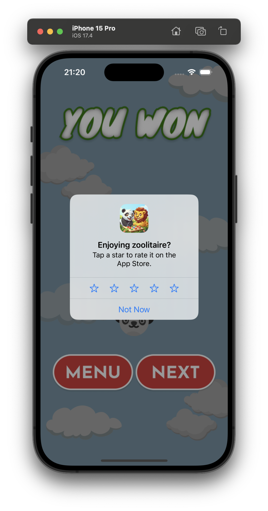
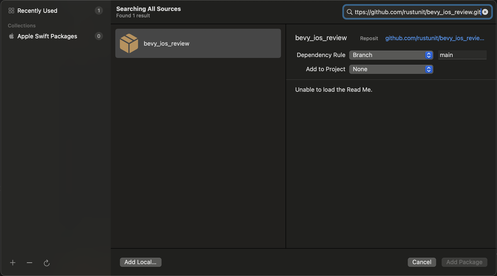

# bevy_ios_review

[](https://crates.io/crates/bevy_ios_review)

Rust crate and Swift package to easily integrate iOS's `requestReview` API into a Bevy application.


example screenshot from our game using this crate: [zoolitaire.com](https://zoolitaire.com)

## Instructions

1. Add to XCode: Add SPM (Swift Package Manager) dependency
2. Add Rust dependency
3. Setup Plugin

### 1. Add to XCode

Go to `File` -> `Add Package Dependencies` and paste `https://github.com/rustunit/bevy_ios_review.git` into the search bar on the top right:


### 2. Add Rust dependency

```
cargo add bevy_ios_review
``` 

or 

```
bevy_ios_review = { version = "0.1" }
```

### 3. Setup Plugin

Initialize Bevy Plugin:

```rust
app.add_plugins(bevy_ios_review::IosRequestReviewPlugin);
```

Trigger Review Event in your application code:

```rust
fn some_system(mut event: EventWriter<IosRequestReview>) {
    event.send(IosRequestReview);
}
```